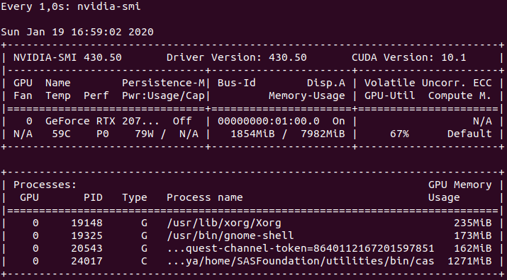

# SAS Viya Programming Only Docker Container with GPU acceleration

This repository provides build instructions to create your own SAS Viya Programmling Only Docker Container with GPU acceleration.

### Overview
There is an official GitHub repository from SAS for Docker containers that you can find here:<br>
[SAS® Viya® Container Recipes](https://github.com/sassoftware/sas-container-recipes)

However the provided recipes don't offer GPU acceleration which is needed or at least recommended if you want to work with deep learning.
For this reason I decided to share my work of creating GPU accelerated for SAS Viya Programming Only environments.

Please note:
This repository is privately owned by me. Don't expect any official support for the work provided here.

### Requirements
* Valid SAS Viya license file (tested with SAS Viya 3.5)
* System with NVIDIA GPU (tested with RTX2070, RTX3000 and V100)
* Linux OS (tested with Ubuntu 18.04 and Centos 7)
* NVIDIA Driver (tested with version 430/450)
* [NVIDIA Docker](https://github.com/NVIDIA/nvidia-docker)

### Container Setup
1. Pull this repository<br>
```
git clone https://github.com/Mentos05/SAS_Viya_GPU.git
```
2. Go into the repository folder and run docker build command<br>
```
cd SAS_Viya_GPU
docker build .  -t viyaprgonly:gpu
```

### Run Container
1. Simply use docker run and attach your gpus
```
docker run -it --net=host --gpus all viyaprgonly:gpu
```

### Access SAS Studio and Jupyter Lab
Open one of the following URLs in your browser:
* SAS Studio: http://localhost/SASStudio/
* JupyterLab: http://localhost:8080

Use the following credentials:<br>
Username = sas<br>
Password = Orion123

### Whats next?
Connect to your container, e.g. via [SAS SWAT](https://github.com/sassoftware/python-swat).
```
from swat import *
s = CAS('localhost', 5570, 'sas', 'Orion123')
```

### Jupyter Lab (Python Environment)
Some of the Python packages installed are:<br>

| Package | Description |
| ------ | ------ |
| SAS SWAT | [SAS SWAT](https://github.com/sassoftware/python-swat) |
| SAS DLPy | [SAS DLPy](https://github.com/sassoftware/python-dlpy) | 
| OpenCV | [OpenCV](https://github.com/skvark/opencv-python) | 
| ONNX | [ONNX](https://github.com/onnx/onnx) |
| Keras | [Keras](https://github.com/keras-team/keras) |
| TensorFlow | [TensorFlow](https://github.com/tensorflow/tensorflow) | 
| PyTorch | [PyTorch](https://github.com/pytorch/pytorch) |

For a full list, please look at the python_sas.yml file in /jupyterlab_environments folder.
When building your own container, you can add your own environment.yml files into /jupyterlab_environments folder to have customized Python environments.

### Share ressources with your container
If you want to share ressources with your container, e.g. a webcam, you can do so by adapting your docker run command.<br>
To share devices, e.g. your webcam, use:
```
docker run --device=/dev/video0:/dev/video0 --net=host viyaprgonly:gpu
```
To share a folder, e.g. with additional data like models, projects, etc. use:
```
docker run -v folder-on-host:folder-on-container --net=host viyaprgonly:gpu
```

### Verify/Monitor GPU Usage
While you should notice a significant performance improvement while training/scoring your deep learning models you can also monitor GPU usage by using:
```
watch -n 1 nvidia-smi
```. 
nvidia-smi should show a cas-process.
<br>
Make sure you run this command on your host, not inside the container.

### Private Repository
Please Note: This is my private repository and not an official SAS repository.<br>
If you are looking for official SAS repositories, please go to:
* [SAS® Viya® Container Recipes](https://github.com/sassoftware/sas-container-recipes)
* [SAS Scripting Wrapper for Analytics Transfer (SWAT)](https://github.com/sassoftware/python-swat)
* [SAS Viya Deep Learning API for Python](https://github.com/sassoftware/python-dlpy)
* [SAS Event Stream Processing Python Interface](https://github.com/sassoftware/python-esppy)

### Contact
If you like to discuss how deep learning can be applied to your problems, you're of course free to contact me.<br>

| Channel | Adress |
| ------ | ------ |
| Email Work | michael.gorkow@sas.com |
| Email Private | michaelgorkow@gmail.com |
| LinkedIn | [LinkedIn Profile](https://www.linkedin.com/in/michael-gorkow-08353678/) |
| Twitter | [Twitter Profile](https://twitter.com/GorkowMichael) |
